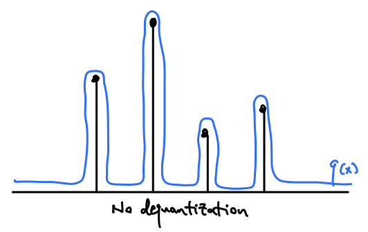
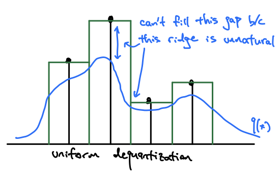
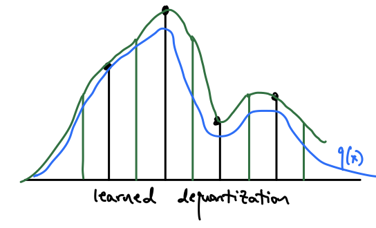

In this post I'll discuss methods for dequantizing discrete values for continuous distributions.
We'll start with why dequantization is needed, a simple method for the problem, and a more
flexible and general method recently proposed in the Flow++ paper [1].

Most measurements in the real world are continuous, and therefore we may want to use a continuous
distribution with a to model them. However, for the sake of storage, most measurement values are clipped to 
a pre-defined discrete set of values (aka. *quantized*). For instance, we typicall quantize images
to an 8-bit integer in the range $$[0, 255]$$.

If we naively fit a continuous distribution to these quantized values, the model can learn to achieve
high lihelihood by placing large spikes at these quantized values, while making the likelihood low 
everywhere else. This is an unnatural distribution that is unlikely to appear in the real world
, and we would like to discourage our model from overfitting like this to the quantization. For the sake of
simplicity, let's assume our data is images, and has been quantized to the $$[0, 255]$$ in 
increments of 1.

 

What might we do to prevent these spikse at the quantization centers? You might intuitively think to
add some noise to smooth the values. $$u \sim Uniform(0, 1)$$ seems like a decent choice, since we just
"fill" those quantization buckets equally. This is in fact the 
most common approach to dequantize discrete values for a continuous distribution [2].
However, this approach introduces flat step-wise regions into the data distribution, and while it's better
than having spikes, it is also unnatural and difficult to fit most parametric distributions.

 

How do we improve this? We still want to add some smoothing noise $$u$$, but we don't want it to 
be uniform noise around the quantization centers. So let's make it a distribution that is dependent on
what the value of $$x$$ is, and let's learn that distribution, $$u \sim r(u|x)$$.

In order to learn $$r(u|x)$$, we need a loss function. It turns out the "hack" of adding quantization noise, 
learned or not, is actually sound in that it upper bounds the continuous data likelihood by the discrete 
data likelihood. I prefer the notation of [1], but like the derivation of [2], so I'm going to mix the two.
Hopefully it makes it clearer, not more confusing.

We want to learn a continuous distribution $$q(x)$$ for the data. Since the data we have are actually
discrete and quantized, let's say $$q$$ integrated over the quantization bin gives you the discrete distribution:

$$
Q(x) = \int_{[0, 1)} q(x+u) du
$$

Let's define $$P(x)$$ as the discrete, quantized data distribution that we are trying to fit. 
The discrete maximum likelihood estiamtor is $$ \mathop{\mathbb{E}}_{x \sim P(x)}[Q(X)] $$

$$
\begin{align}
\mathop{\mathbb{E}}_{x \sim P(x)}[Q(X)] 
&= \mathop{\mathbb{E}}_{x \sim P(x)}\left[\log \int_{[0, 1)} q(x+u) du\right] \\[10pt]
&= \mathop{\mathbb{E}}_{x \sim P(x)}\left[\log \int_{[0, 1)} r(u|x) \frac{q(x+u)}{r(u|x)} du\right] \\[10pt]
&= \mathop{\mathbb{E}}_{x \sim P(x)}\left[\log \mathop{\mathbb{E}}_{u \sim r(u|x)} \left[\frac{q(x+u)}{r(u|x)} \right]\right] \\[10pt]
&\ge \mathop{\mathbb{E}}_{x \sim P(x)}\mathop{\mathbb{E}}_{u \sim r(u|x)} \left[\log \frac{q(x+u)}{r(u|x)} \right] \\[10pt]
&= \mathop{\mathbb{E}}_{x \sim P(x)}\mathop{\mathbb{E}}_{u \sim r(u|x)} \left[\log q(x+u) - \log r(u|x) \right]
\end{align}
$$

What we've done here is introduced a variational distribution to model the noise. If we use a 
flow for $$r(u|x)$$, we can train the model and dequantizer together using the path-wise gradient estiamtor 
similar to the reparameterization trick in VAEs. Note that the using uniform noise to dequantize is simply choosing
it to be $$r$$.

 

By jointly training the noise distribution model and the data distribution model, we can find a dequantization method that is both
a valid upper bound and is more natural for the data distribution to fit to.

### References

[[1] Flow++: Improving Flow-Based Generative Models with Variational Dequantization and Architecture Design](https://arxiv.org/abs/1902.00275)

[[2] A note on the evaluation of generative models](https://arxiv.org/abs/1511.01844)

