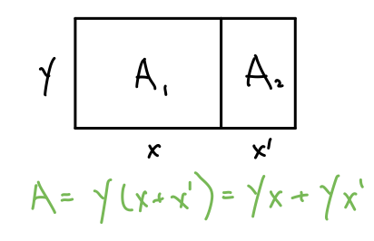
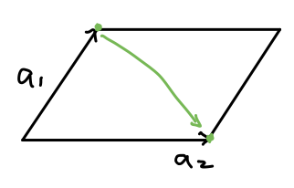

If your experience learning about the determinant of a matrix in an introductory linear algebra class
was anything like mine, it went something like this: you start with the formula for the determinant of a 2x2 matrix,
then a 3x3 matrix, perhaps a generic formula or algorithm for any square matrix, finally ending with a statement
like "we care about determinants because if it's 0, then the matrix is not invertible". 

Recently in working with the 
[change of variables formula](https://en.wikipedia.org/wiki/Probability_density_function#Dependent_variables_and_change_of_variables)
and [normalizing flows](https://blog.evjang.com/2018/01/nf1.html), I discovered that there is, in fact, a geometric interpretation
of the determinant as the "signed" volume change of a linear transformation. In this post, I'll try to provide an intuitive explanation
and derivation of the determinant by constructing it from this intuition.

## Linear Transformation & Volume Change

3Blue1Brown has a great video explaining what the determinant is visually.
Since he does a much better job of it than I think I ever could, I'll just embed it here.

<iframe width="560" height="315" src="https://www.youtube.com/embed/Ip3X9LOh2dk" frameborder="0" allow="accelerometer; autoplay; encrypted-media; gyroscope; picture-in-picture" allowfullscreen></iframe>

Equipped with this intuition, let's take a slightly more mathematical approach to derive the determinant formula.

## Volume, and it's Properties

Rather than worrying about linear transformations, let's just consider points in space for now. 
Given a matrix $$A \in R^{(n \times n)}$$, let's define a function $$ V = \text{det}(a_1, ..., a_n)$$ over the columns of $$A$$
such that $$V$$ is the volume of the parallelepiped with vertices $${a_1, ..., a_n}$$.

Intuitively, what would we expect a quantity that we claim is the volume to have?

### Multilinear

We would expect that the volume is linear in one of the vectors $$a_i$$, if we hold all other vectors constant. 
This is what we naturally expect from simple geometry, as illustrated in the 2D case below.

This is known as **multilinearity**. In general:

$$
\text{det}(x \cdot a_1 + y, ..., a_n) = x \cdot \text{det}(a_1, ..., a_n) + \text{det}(y, ..., a_n)
$$

### Alternating

We would expect that if any two of $$\{a_1, ..., a_n\}$$ are the same point, the volume would "collapse" to 0. 
Again, this is intuitive in 2D. If $$a_1 = a_2$$, then the volume of the parallelogram would be 0.

This necessarily implies that if we swapped the order of the two of the columns of A, then the determinant will change signs.
This is known as the **alternating** property.

$$
\begin{align}
0 = \text{det}(a, v+w, v+w) 
&= \text{det}(a, v, v+w) + \text{det}(a, w, v+w) \\
&= \text{det}(a, v, v) + \text{det}(a, v, w) + \text{det}(a, w, v) + \text{det}(a, w, w) \\
&= \text{det}(a, v, w) + \text{det}(a, w, v) \\
& \Rightarrow \text{det}(a, v, w) = -\text{det}(a, w, v)
\end{align}
$$

### Determinant of Unit Hypercube is 1

The volume of the hypercube defined by standard basis vectors should be 1, $$\text{det}(e_1, ..., e_n) = 1$$.

## Derivation

We can now derive the formula for the derterminant from these properties. Note that we can write any $$a_j$$ as a linear
combination of the standard basis $$a_j = \alpha_{1,j} e_1 + ... + \alpha_{n,j} e_n$$. I'm using the convention that
$$a_{i,j}$$ is the $$i$$-th row and $$j$$-th column of the matrix $$A$$. Combining this with multilinearity:

$$
\begin{align}
\text{det}(a_1, a_2, ..., a_n) 
&= \text{det}(\alpha_{1,1} e_1 + ... + \alpha_{n,1} e_n, a_2, ..., a_n) \\
&= \sum_{c_1} \alpha_{c_1, 1} \cdot \text{det}(e_{c_1}, a_2, ..., a_n) \\
&= \sum_{c_1} \alpha_{c_1, 1} \cdot \text{det}(e_{c_1}, \alpha_{1,2} e_1 + ... + \alpha_{n,2} e_n, ..., a_n) \\
&= \sum_{c_1} \sum_{c_2} \alpha_{c_1, 1}\alpha_{c_2, 2} \cdot \text{det}(e_{c_1}, e_{c_2}, ..., a_n) \\
& \dots \\
&= \sum_{c_1, ..., c_n} \left[\prod_i \alpha_{c_i, i} \right] \cdot \text{det}(e_{c_1}, e_{c_2}, ..., e_{c_n}) \\
\end{align}
$$

Note that there are $$n^n$$ terms in the sum, but most of these will have some $$e_{c_i} = e_{c_j}, i \neq j$$ 
which makes determinant term 0 due to the alternating property. In fact, we see that *only valid
[permutations](https://en.wikipedia.org/wiki/Permutation) of $$(1, ..., n)$$ will have a non-zero determinant term.*
We'll define this set of valid permutations as $$S_n$$.

Moreover, since the valid permutations are all over the standard basis, the absolute value of the determinant will 
be 1, and it's sign depends on how many swaps we did from the natural order $$(e_1, ..., e_n)$$. We will define 
the sign $$sgn(\sigma), \sigma \in S_n$$ as $$-1$$ raised to the number of swaps. This allows us to simplify the 
equation above to:

$$
\text{det}(a_1, a_2, ..., a_n) = \sum_{\sigma \in S_n} sgn(\sigma) \prod_i \alpha_{\sigma(i), i}
$$

We've now arrived at the [Leibniz formula](https://en.wikipedia.org/wiki/Leibniz_formula_for_determinants) for determinants.

## A Note on Linear Transforms

I want to end by tying determinants back to linear transformations.
We know that columns of matrices can be thought of as indicating where the standard basis ends up
as a result of some linear transform ([link](https://youtu.be/kYB8IZa5AuE)). We also know that
$$\text{det}(e_1, ..., e_n) = 1$$, so determinants describe the ratio of volume change
from the unit hypercube as a result of some linear transformation.

Thinking of determinants as volumes change makes many of it's properties intuitive. For instance:

* If some matrix has $$\text{det}(A)=0$$, ie it "collapses" the space, 
it's easy to see that the linear transform might be hard to "undo" and so the matrix won't be invertible.
* Doing two transformations in a row scales the volume multiplicatively, so $$\text{det}(AB) = \text{det}(A) \cdot \text{det}(B)$$.
* When the matrix is intertible, doing the reverse transformation should change the volume back, so $$\text{det}(A^{-1}) = \text{det}(A)^{-1}$$.

